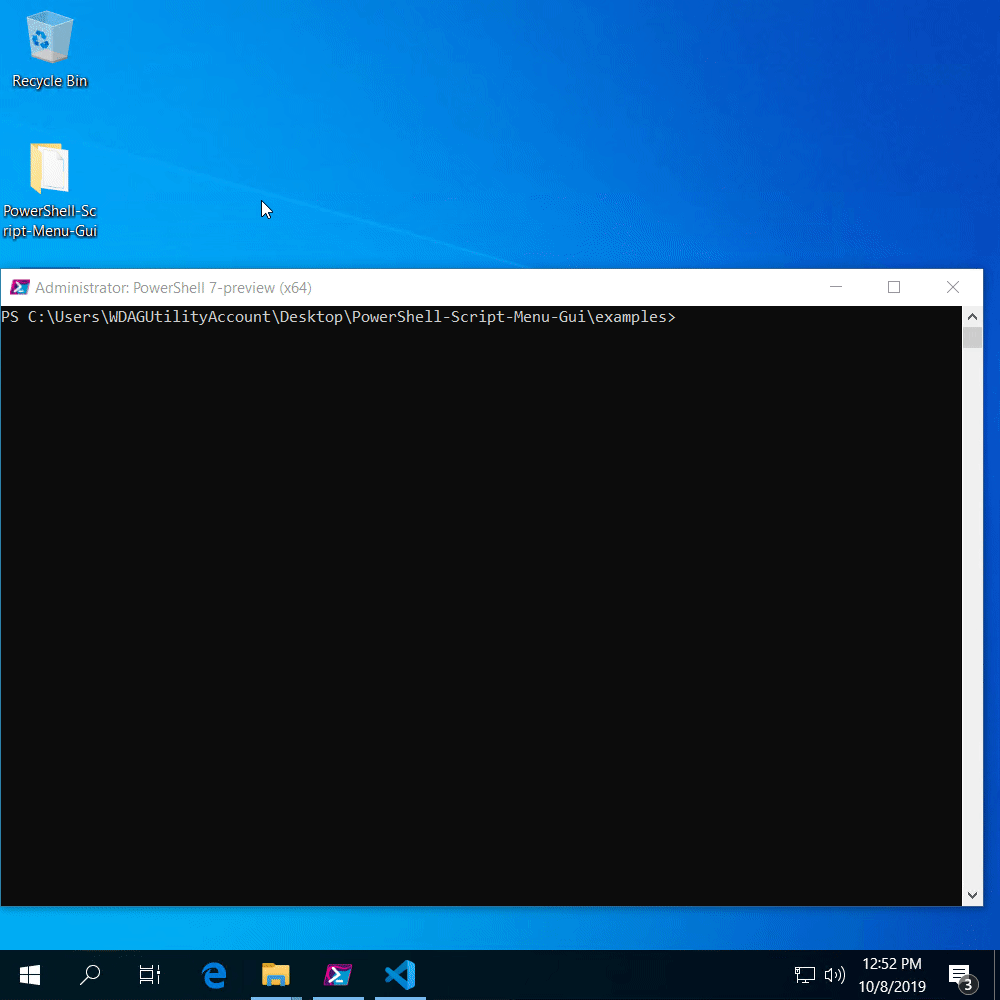
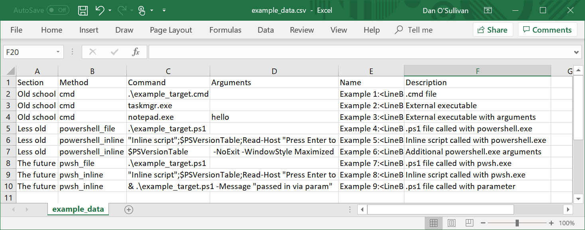

# PSScriptMenuGui

Do you have favourite scripts that go forgotten?

Does your organisation have scripts that would be useful to frontline staff who are not comfortable with the command line?

This module uses a CSV file to make a graphical menu of PowerShell scripts.

It's easy to customise and fast to launch.

You can also add Windows programs and files to the menu.

Just a few minutes to setup and - *click! click!* - you're away!

This an early version. What do you think? What's missing?

Feedback very welcome.

[@dan_osull.com](https://twitter.com/dan_osull_com/)  
https://blog.osull.com  
powershell@osull.com

## Compatibility

- Tested with **PowerShell 5.1 x64** and **PowerShell 7-preview 4 x64** on Windows 10.
- This module does not currently work with PowerShell 7-preview in the VS Code integrated console.

## Try it out

    git clone https://github.com/weebsnore/PowerShell-Script-Menu-Gui
    cd PowerShell-Script-Menu-Gui/PSScriptMenuGui/examples
    .\PSScriptMenuGui.ps1

Or - if you don't have Git - [download the project ZIP](https://github.com/weebsnore/PowerShell-Script-Menu-Gui/archive/master.zip), unzip somewhere convenient, and experiment with editing [`PSScriptMenuGui\examples\example_data.csv`](PSScriptMenuGui/examples/example_data.csv) and running [`PSScriptMenuGui\examples\PSScriptMenuGui.ps1`](PSScriptMenuGui/examples/PSScriptMenuGui.ps1)

When the module is a bit more mature I'll put it in the PowerShell Gallery so it can be installed with `Install-Module`

## Basic usage

    Show-ScriptMenuGui -csvPath '.\example_data.csv' -Verbose

## `Show-ScriptMenuGui` options

Parameter | What is it?
:--- |:---
`-csvPath` | Path to CSV file that defines the menu. See [CSV reference](#csv-reference), below.
`-windowTitle` *(optional)* | Custom title for the menu window
`-buttonForegroundColor` *(optional)* | Custom button foreground (text) color. Hex codes (e.g. `#C00077`) and color names (e.g. `Azure`) are valid. See [.NET Color Class](https://docs.microsoft.com/en-us/dotnet/api/system.windows.media.colors).
`-buttonBackgroundColor` *(optional)* | Custom button background color
`-iconPath` *(optional)* | Path to .ico file for use in menu
`-hideConsole` *(optional)* | Hide the PowerShell console that the menu is called from. **Note:** This means you won't be able to see any errors from button clicks. If things aren't working, this should be the first thing you disable.
`-noExit` *(optional)* | Start all PowerShell instances with `-NoExit` *("Does not exit after running startup commands.")*. **Note:** You can set `-NoExit` on individual menu items by using the *Arguments* column. See [CSV reference](#csv-reference), below.

See [`PSScriptMenuGui_all_options.ps1`](PSScriptMenuGui/examples/PSScriptMenuGui_all_options.ps1) for an example using every option.

## CSV reference

This table details how you need to lay out the CSV file for your menu:

Column header | What is it?
:--- |:---
Section *(optional)* | Text for heading
Method | What happens when you click the button? Valid options: `cmd` \| `powershell_file` \| `powershell_inline` \| `pwsh_file` \| `pwsh_inline`
Command | Path to target script/executable (`cmd` or `_file` methods) ***or*** PowerShell commands (`_inline` methods)
Arguments *(optional)* | Arguments to pass to target executable (`cmd` method) ***or*** to the PowerShell exe (other methods)
Name | Text for button
Description *(optional)* | Text for description 

### Some examples

Section | Method | Command | Arguments | Name | Description
:---|:---|:---|:---|:---|:---
Old school | `cmd` | `taskmgr.exe` | | Example 2: cmd | External executable
Old school | `cmd` | `notepad.exe` | `hello` | Example 3: cmd | External executable with arguments
Less old | `powershell_file` | `example_target.ps1` | | Example 4: powershell_file | .ps1 file called with powershell.exe
Less old | `powershell_inline` | `$PSVersionTable` | `-NoExit -WindowStyle Maximized` | Example 6: powershell_file | Additional powershell.exe arguments
The future | `pwsh_file` | `example_target.ps1` | | Example 7: pwsh_file | .ps1 file called with pwsh.exe
The future | `pwsh_inline` | `& .\example_target.ps1 -Message "passed in via param"` | |Example 9: pwsh_inline | .ps1 file called with parameter

See [`example_data.csv`](PSScriptMenuGui/examples/example_data.csv) for further examples in CSV format.

### Tips

- Relative paths, network paths and paths in your environment should work.
- `<LineBreak />` is supported in text fields.
- You can add multiple `_inline` commands by separating with a semi-colon (`;`)
- Excel makes a good editor!
- But watch out for Excel turning e.g. `-NoExit` into a formula. Best workaround is to prefix with a space.

## Known issues

- Various minor issues - see `TODO:` comments in code.
